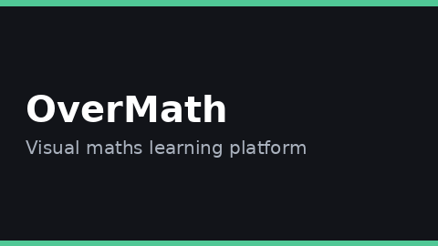
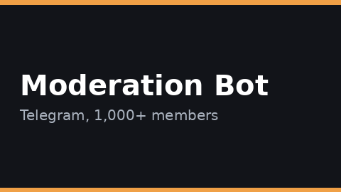
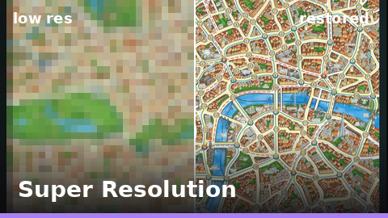
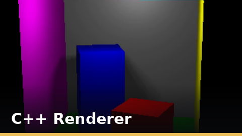
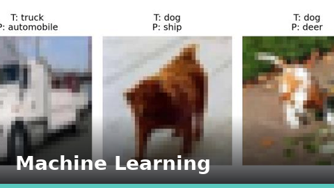
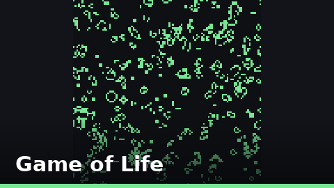
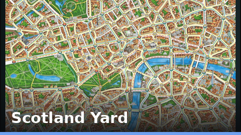

# Sami Alharbi

**Computer Science and Electronics graduate, University of Bristol.** Software engineering and backend development.

I build full stack web applications and systems, from gathering requirements with clients through to production deployment. BEng Computer Science and Electronics, graduated June 2026.

## Closed source

<table>
<tr>
<td width="50%" valign="top">
 
<b>OverMath Academy.</b> Full stack web development. A visual maths learning platform that I designed and built on my own: the backend, the frontend, the design, and the lesson content. <a href="https://www.overmath.academy/">Live site</a>. Closed source.
</td>
<td width="50%" valign="top">
 
<b>Automation tool, Saudi Society in Bristol.</b> Automation and bot development. A tool that moderates a Telegram community of over 1,000 members, finding and removing messages that break the rules on its own. Closed source. <a href="https://www.linkedin.com/posts/sami-alharbi-2533ba360_glad-to-share-with-you-what-i-have-contributed-share-7390132103667011584-2hbp/">Certificate</a>.
</td>
</tr>
</table>

## Open source

<table>
<tr>
<td width="50%" valign="top">
 
<b>Image Super Resolution.</b> Machine learning, in Python. A final year group study that compared seven machine learning methods for turning low resolution images sharp. My method scored the highest in the group's evaluation.
</td>
<td width="50%" valign="top">
 
<b>3D Renderer.</b> Graphics programming, in C++. A renderer written from scratch with no game engine: soft shadows, glass, metals, and depth of field. First class.
</td>
</tr>
<tr>
<td width="50%" valign="top">
 
<b>Machine Learning Studies.</b> Machine learning, in Python. Four studies: predicting numbers with regression, recognising images, grouping data into clusters, and modelling sequences. First class.
</td>
<td width="50%" valign="top">
 
<b>Conway's Game of Life.</b> Concurrent and distributed programming, in Go. The same simulation built two ways: first run in parallel on one machine, then spread across a network of servers.
</td>
</tr>
<tr>
<td width="50%" valign="top">
 
<b>Scotland Yard Game Engine.</b> Object oriented programming, in Java. The full rules of the board game Scotland Yard: the legal moves, whose turn it is, and who wins.
</td>
<td width="50%" valign="top"></td>
</tr>
</table>

## Tech

**Languages:** Java, Python, C, C++, Go, Haskell

**Backend:** Spring Boot, Node.js, Spring Security (JWT, OAuth2), Kafka

**Frontend:** React

**Data and cloud:** MySQL, Spring Data JPA, AWS, Google Cloud, Vercel, Railway, CI/CD

**Also:** system design, and machine learning including image processing

## Links

[LinkedIn](https://www.linkedin.com/in/sami-alharbi-2533ba360/) · [overmath.academy](https://www.overmath.academy/)
